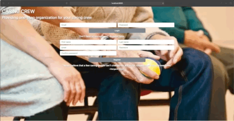

Caring Crew is a web-based app, created using Python and Django, to help family members and other caregivers track the needs of their loved ones for whom they provide care. 

FEATURES
- Track and add doctors for each loved one and add notes from/for the doctor pertaining to that particular patient
- Notes display on the dashboard for convenience when viewing the profile
- Track and add medications for each loved one

PLANNED UPDATES
- Notes for medications, including why changes were made
- Integrated calendar to show upcoming appointments and for the primary caregiver to request respite care
- A list of caregivers and their available times for helping
- A guest page for temporary caregivers to have access to only necessary information to provide care (to protect the patient's information)
- Access limited to those who have been invited
- Ability to upload pictures of medication

DEMO

